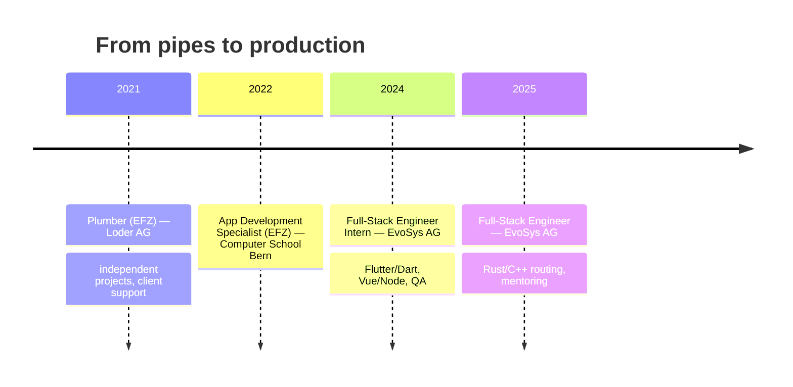
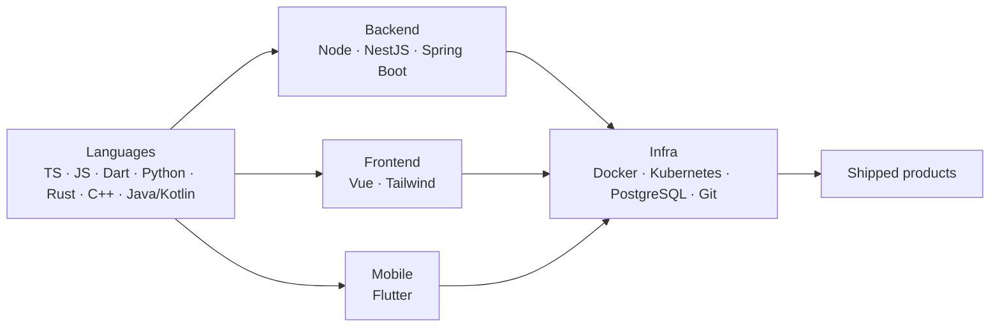

### Hi 👋 I'm Joël

### 🧭 About

Full Stack Software Engineer who owns products end-to-end — from system architecture to rollout. I specialize in **Node.js, Vue.js, and Flutter**, build high-performance microservices, and chase clean code that delivers real value. I started as a plumber and rebuilt my career from the ground up. 🛠️ → 💻

### 🧗 The Journey

### 🗺️ How I Build

### 🛠️ Tech Stack

### 🚀 Featured Builds

| Project               | What it is                                                               | Stack          |
| --------------------- | ------------------------------------------------------------------------ | -------------- |
| **aare-temp-menubar** | Live Aare river temperature in the macOS menubar (`brew tap jl115/aare`) | Python · macOS |

### 🐍 Contribution Graph

<!-- Snake appears after the first run of the Generate Snake workflow -->

### 📊 GitHub Stats

### 🎓 Certifications & Languages

### 🔗 Connect

