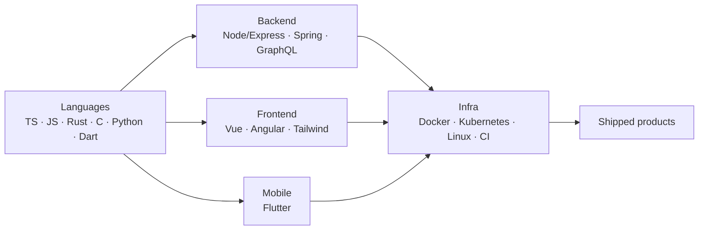

### Hi 👋 I'm Joël

---

### 🧭 About

Full-stack engineer who loves owning products end-to-end — from TypeScript backends and Vue frontends to Flutter mobile apps and the Docker/CI underneath them. Currently exploring low-level systems (Rust + C) on the side. I care about clean architecture, modular design, and shipping.

---

### 🗺️ How I Build

---

### 🛠️ Tech Stack

---

### 🚀 Featured Projects

| Project | What it is | Stack |
| --- | --- | --- |
| **argus** | Tracker/IoT data backend — architecture, connectors, stateless sockets | TypeScript · Node |
| **aare-temp-menubar** | Live Aare river temperature in the macOS menubar (`brew tap jl115/aare`) | Python · macOS |
| **portfolio** | Personal site | Vue · TypeScript |

---

### 📊 GitHub Stats

---

### 📈 Contribution Activity

---

### 🔗 Connect

